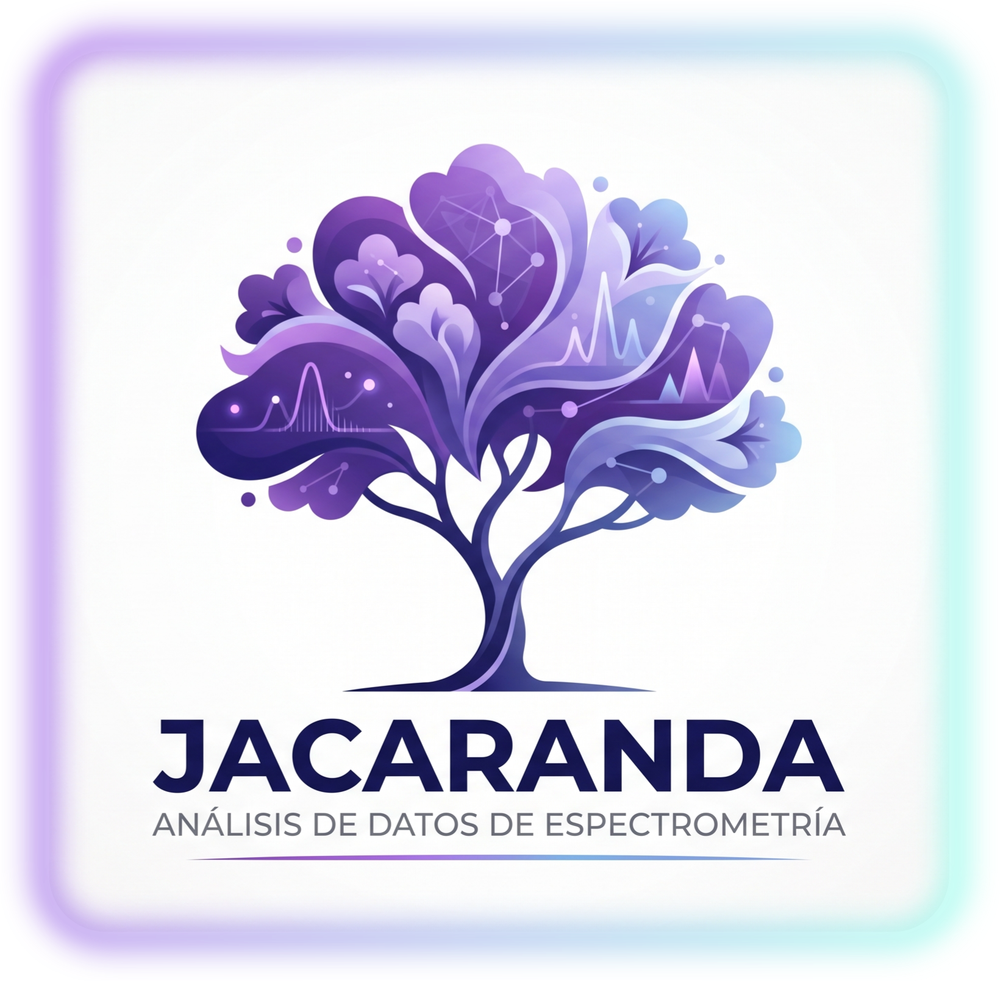

<div align="center">



# Jacarandá

### Análisis de Espectros de Emisión y Error Sistemático

Aplicación de escritorio para el análisis de espectros de emisión atómica obtenidos con
espectrómetro de red de difracción, con comparación contra espectros tabulados y la base de
datos atómica **NIST ASD**, y estimación del error sistemático del cero angular del instrumento.

</div>

---

## ✨ Características

- **Ingreso de datos**: registro de mediciones angulares (grados, minutos, segundos), cálculo
  automático de longitudes de onda y propagación de incertidumbres.
- **Visualización y revisión**: tablas de datos medidos y tabulados para cada elemento.
- **Generación de gráficos**: espectros medidos, tabulados y comparados (SVG exportables).
- **Análisis de error sistemático**:
  - Ajuste por mínimos cuadrados para estimar el desplazamiento `Δλ` de todo el espectro.
  - Conversión a error del cero angular `Δθ` del espectrómetro.
  - Proyección coseno vectorial (`cos φ`) entre espectro medido y referencia.
  - Diagnóstico de calibración lineal (`a`, `b`, `R²`).
  - Referencia configurable: **datos tabulados guardados** o **líneas NIST ASD** vía API.
  - Incertidumbres formateadas a **1 cifra significativa**.
- **Sincronización automática** del elemento seleccionado entre todas las pestañas.
- **Tema oscuro** y estética unificada (logo Jacarandá).
- Crea un **lanzador de escritorio** (.desktop) al iniciarse.

## 📦 Requisitos

- Python 3.10+
- PyQt6 (interfaz gráfica)
- numpy, pandas, matplotlib
- uncertainties (propagación de errores)
- astropy + astroquery (consultas NIST ASD)
- IPython

## 🚀 Instalación

```bash
# 1. Clonar el repositorio
git clone https://github.com/FabriTape/Jacaranda.git
cd Jacaranda

# 2. Crear y activar un entorno virtual (opcional pero recomendado)
python -m venv .venv
source .venv/bin/activate

# 3. Instalar dependencias
pip install -r requirements.txt

# 4. Ejecutar
python main.py
```

> ⚠️ La pestaña *Reproductor* usa un archivo de audio local (`*.mp4`) que **no se sube al
> repositorio**. La aplicación funciona igual si el archivo no está presente.

## 🧪 Datos del laboratorio

Los datos de medición se organizan por elemento en carpetas `Lab_2_<Elemento>`:

```
Lab_2_Kr/                          # Datos medidos del Kriptón
├── Lab_2_Kr_Angulo_Grados.csv     # Ángulos medidos (grados, minutos, segundos)
├── Lab_2_Kr_Lambda.csv            # Longitudes de onda calculadas
├── Metadatos_Lab_2_Kr_....csv     # Parámetros del espectrómetro
└── Lab_2_Kr_Espectro_*.svg        # Espectros generados
Lab_2_Kr_Tabulado/                 # Espectro tabulado de referencia
└── Lab_2_Kr_Tabulado_Lambda.csv
```

Elementos incluidos: **Ar, He, Hg, Kr, Dióxido de carbono** y su espectro de desplazamiento
comparativo en `Desplazamiento/`.

Para añadir una nueva medición de un elemento existente sin sobrescribir las anteriores,
ingresar el nombre con sufijo, p. ej. `Kr_2`.

## 🗂️ Estructura del proyecto

```
Jacaranda/
├── main.py                 # Punto de entrada de la aplicación
├── core/                   # Lógica de física, datos y servicio NIST
│   ├── physics.py          # Cálculos físicos y análisis de error sistemático
│   ├── data_manager.py     # Carga/guardado de CSV y metadatos
│   └── nist_service.py     # Consulta de líneas NIST ASD
├── ui/                     # Interfaz gráfica (PyQt6)
│   ├── style.py            # Tema oscuro
│   ├── tabs/               # Pestañas de la aplicación
│   └── widgets/            # Widgets reutilizables (canvas, tablas, ayuda)
├── Lab_2_*/                # Datos experimentales por elemento
├── Emision_abs.ipynb       # Notebook con los modelos matemáticos originales
├── requirements.txt
└── Jacaranda.png           # Logo
```

## ⚖️ Licencia

Código libre, disponible para ser editado y mejorado.

---

<div align="center">

**Laboratorio de Física · Análisis de Emisión de Gases** · UNCuyo

</div>
